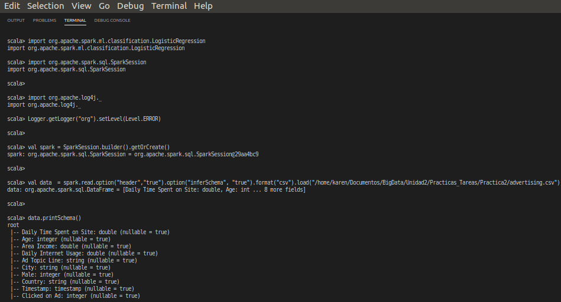
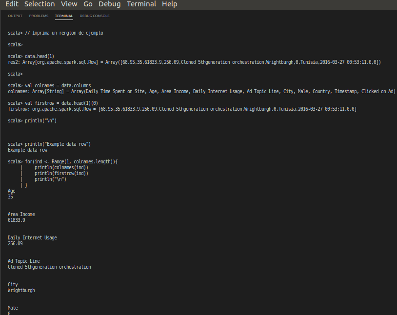
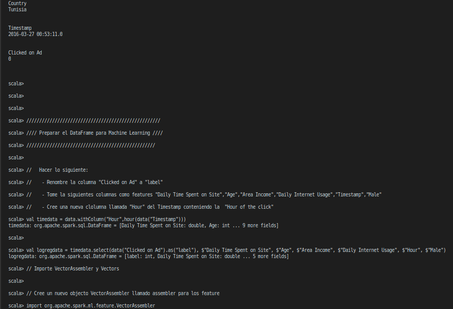
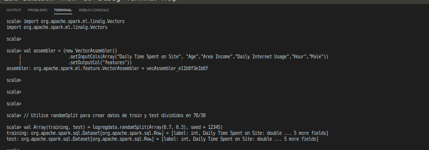
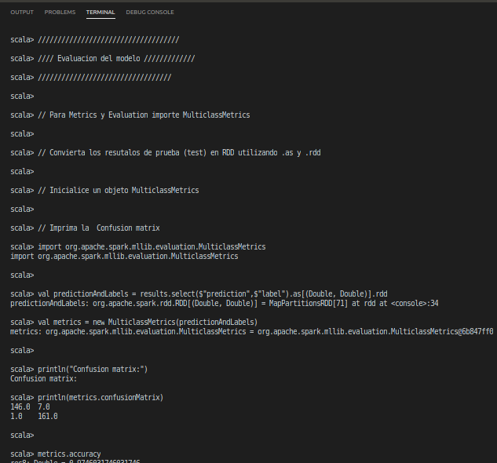

### :memo: PRACTICE 2: Logistic Regression

> The first thing we do is import the spark libraries with LogisticRegresion

```scala
import org.apache.spark.ml.classification.LogisticRegression
import org.apache.spark.sql.SparkSession

```
> With this library we reduce the number of alerts and errors that when executing our program

```scala
import org.apache.log4j._
Logger.getLogger("org").setLevel(Level.ERROR)
```
> We create a spark session and add it to an immutable variable called **spark**

```scala
val spark = SparkSession.builder().getOrCreate()
```
> We get and load our csv data to an immutable variable called data

```scala
val data  = spark.read.option("header","true").option("inferSchema", "true").format("csv").load("/home/eduardo/Escritorio/semestre_9/BigData/Unidad2/Practicas_Tareas/Practica2/advertising.csv")

```
> We print a schematic of the dataframe

```scala
data.printSchema()
```
> From the dataframe we print the first line

```scala
data.head(1)
```
> We pass the columns of the dataframe to a variable colnames and to another variable firstrow we pass the first column of data, we print a line break

```scala
val colnames = data.columns
val firstrow = data.head(1)(0)
println("\n")
```
> We print an "Exple data row" label.
In a for loop we assign a variable ** ind ** in a range of 1 and the length of the columns of the dataframe ** colnames.length ** and we will print this data with its respective column

```scala
println("Example data row")
for(ind <- Range(1, colnames.length)){
    println(colnames(ind))
    println(firstrow(ind))
    println("\n")
}
```
> The next thing to do is prepare our dataframe to do Machine Learning

> We make a new data frame called timedate adding a new column ** Hour ** taking the hours from the Timestamp column

```scala
val timedata = data.withColumn("Hour",hour(data("Timestamp")))
```
> We make a new variable **logregdata**, to this variable we assign 7 columns of the variable **data** one of them "Clicked on Ad" we rename it as "label". The columns of the **logregdata** are:
* label
* Daily Time Spent on Site
* Age
* Area Income
* Daily Internet Usage
* Hour
* Male

```scala
val logregdata = timedata.select(data("Clicked on Ad").as("label"), $"Daily Time Spent on Site", $"Age", $"Area Income", $"Daily Internet Usage", $"Hour", $"Male")
```
> We import the VectorAssembler and Vectors ml libraries

```scala
import org.apache.spark.ml.feature.VectorAssembler
import org.apache.spark.ml.linalg.Vectors
```
> We create a variable **assembler** in it we add the characteristics that were the ones that we gave to the variable **logregdata**

```scala
val assembler = (new VectorAssembler()
                  .setInputCols(Array("Daily Time Spent on Site", "Age","Area Income","Daily Internet Usage","Hour","Male"))
                  .setOutputCol("features"))

```
> We create an Array with data of the variable "logregdata" and we will divide the data into training data that will be 70% of the data and 30% of test, we will divide the randomSplit function to help us divide the data. The seed parameter guarantees that sampling in the same data set executed several times always returns the same results.

```scala
val Array(training, test) = logregdata.randomSplit(Array(0.7, 0.3), seed = 12345)
```
> Import the Pipeline library. Next we create an "lr" object and assign the class **LogisticRegression()**.


```scala
import org.apache.spark.ml.Pipeline

val lr = new LogisticRegression()
```

> We create a "pipeline" object with two Array assemblers and lr. We assign training data to one "model" variable and to another "result" variable we assign the test data with the test data already with predictions.

```scala

val pipeline = new Pipeline().setStages(Array(assembler, lr))

val model = pipeline.fit(training)

val results = model.transform(test)
```
> We import the library **MulticlassMetrics**

```scala
import org.apache.spark.mllib.evaluation.MulticlassMetrics
```
> We assign "prediction" and "label" to the variable "predictionAndLabels", then we create a ** metrics ** object of "MulticlassMetrics" with the data loaded in "predictionAndLabels". And finally we print our matrix of confusion of "metrics" and "accuracy".

```scala
val predictionAndLabels = results.select($"prediction",$"label").as[(Double, Double)].rdd
val metrics = new MulticlassMetrics(predictionAndLabels)

println("Confusion matrix:")
println(metrics.confusionMatrix)

metrics.accuracy
```





