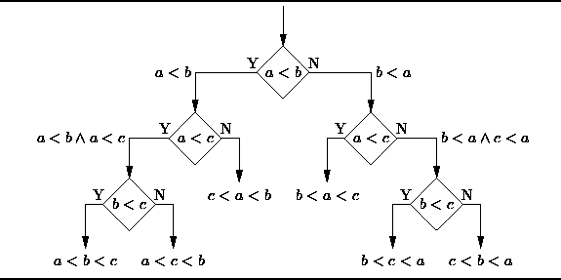
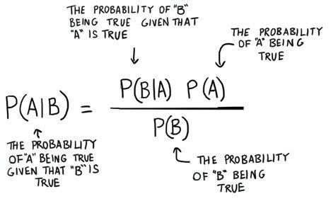
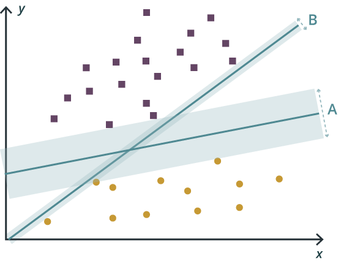
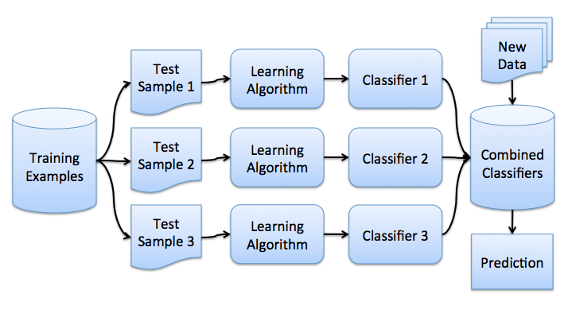
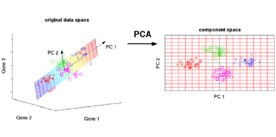
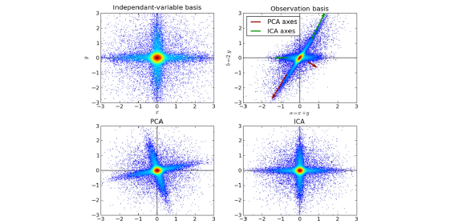

# 
 Major ML algorithms 

## 
 SUPERVISED LEARNING

### Decision trees

A decision tree is a decision support tool that uses a graph or model similar to a decision tree and its possible consequences, including the results of fortuitous events, resource costs, and profit. They have an appearance like this:

They are mainly used for information classification, bifurcating and modeling the possible paths taken and their probability of occurrence to improve their precision. Once assembled, decision trees run very fast to get results.

From a business decision-making point of view, a decision tree is the minimum number of yes / no questions that one has to ask, to assess the probability of making a correct decision, most of the time. This method allows you to approach the problem in a structured and systematic way to reach a logical conclusion.

> The most used decision tree algorithms are:

* Classification and Regression Trees (CART)
* Conditional Tree Decision
* Random Forest

### Naïve Bayes Clasification

Naïve Bayes classifiers are a family of simple probabilistic classifiers based on the application of Bayes ‘theorem with strong (Naïve) assumptions of independence between characteristics’. The featured image is the equation - with P (A | B) being posterior probability, P (B | A) being probability, P (A) being class prior probability, and P (B) being prior probability predictor.

### Ordinary Least Squares Regression

If you've been in contact with statistics, you've probably heard of linear regression before. Ordinary Least Squares Regression is a method of performing linear regression. Linear regression can be thought of as the task of fitting a straight line through a set of points. There are several possible strategies for doing this, and the "ordinary least squares" strategy goes like this: you can draw a line and then, for each of the data points, measure the vertical distance between the point and the line and add them together; The fitted line would be the one in which this sum of distances is as small as possible.

Linear refers to the type of model you are using to fit the data, while least squares refer to the type of error metric you are minimizing.

### Logistic Regression

Logistic regression is a powerful statistical way to model a binomial result with one or more explanatory variables. Measure the relationship between the categorical dependent variable and one or more independent variables by estimating the probabilities using a logistic function, which is the cumulative logistic distribution.

### Support Vector Machines

SVM is a binary classification algorithm. Given a set of points of 2 types at the N-dimensional location, SVM generates a dimensional (N-1) hyperlane to separate those points into 2 groups. Let's say you have some points of 2 types on a piece of paper that are linearly separable. SVM will find a straight line that separates those points into 2 types and located as far as possible from all those points.

In terms of scale, some of the biggest problems that have been solved using SVMs (with suitably modified implementations) are on-screen advertising, human splice site recognition, image-based gender detection, large-scale image classification.

### Ensemble Methods

Ensemble methods are learning algorithms that build a set of classifiers and then classify new data points by taking a weighted vote of their predictions. The original set method is Bayesian averaging, but the latest algorithms include encoding output correction error.

## 
 UNSUPERVISED LEARNING

### Clustering algorithms

Clustering (or grouping algorithm) consists of grouping a series
of vectors according to a criterion in groups or clusters. Generally the criterion
it is usually the similarity so we will say that it groups the similar vectors in
groups. It is considered unsupervised learning within
Data mining.

 

 #### K-means

This algorithm partitions the N objects in K partitions (K being a value
arbitrary) where an object will go to the cluster with the closest mean. The
algorithm assigns K centers randomly, then assigns objects to center
closest. The center is recalculated as the average of the points it has
assigned, once updated, the objects are reassigned to the closest one and thus until convergence.
This algorithm is NP-Hard. Much depends on the initial allocation of
the centers, can give us one result or another so it is better to do several
tests with different values. 

#### K-nearest neighbors

In this algorithm the membership of an object is decided taking into account its
neighbors. Decide which cluster it belongs to by looking at which cluster it belongs to
most of his neighbors K closest to him. It is one of the simplest machine learning algorithms.

#### DBSCAN

DBSCAN is a density-based algorithm for performing the
classification. You have to set a radius E in which we want to find points
and a minimum number of points P to be found within the radius.

1. We start from a random point and see if there is a
minimum of points P in a radius of distance E.
2. If so, this forms a cluster and we return to stage 1 with a point
of those found.
3. If we don't find the minimum number of points but we have reached that point
through a point that if it did, it would be part of the cluster.
In case of not being able to reach a point through others, it will not form
part of the cluster and it would be a noisy node.

This algorithm does not have to fix the number of clusters and has a complexity
of O (n log n).

### Principal component analysis

PCA is a statistical procedure that uses an orthogonal transformation to convert a set of observations of possibly correlated variables into a set of linearly uncorrelated variable values ​​called principal components.

Principal component analysis

Some of the PCA applications include compression, data simplification for easier learning, visualization. Keep in mind that domain knowledge is very important when choosing whether to go ahead with PCA or not. It is not suitable in cases where the data is noisy (all PCA components have a fairly high variation).

 
### Singular Value Decomposition

In linear algebra, SVD is a factorization of a real complex matrix. For a given M * n matrix, there is a decomposition such that M = UΣV, where U and V are unit matrices and Σ is a diagonal matrix.

### Independent Component Analysis

ICA is a statistical technique for revealing hidden factors underlying sets of variables, measurements, or random signals. ICA defines a generative model for the observed multivariate data, which is often given as a large sample database. In the model, the data variables are assumed to be linear mixtures of some unknown latent variables, and the mixing system is also unknown. Latent variables are assumed to be non-Gaussian and mutually independent, and are called independent components of the observed data.

ICA is related to PCA, but it is a much more powerful technique that is able to find the underlying factors of sources when these classic methods fail completely. Its applications include digital images, document databases, economic indicators and psychometric measurements.

https://www.raona.com/los-10-algoritmos-esenciales-machine-learning/

https://www.aprendemachinelearning.com/principales-algoritmos-usados-en-machine-learning/

https://upcommons.upc.edu/bitstream/handle/2117/82434/113257.pdf